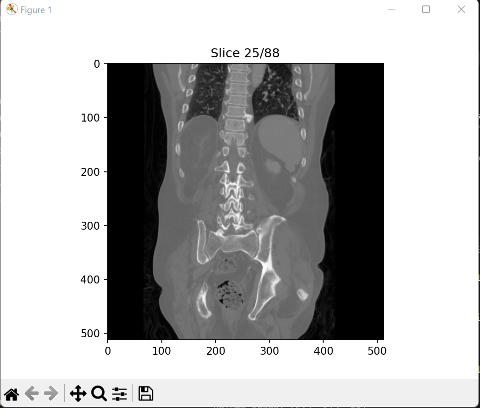

# DICOM Anonymizer & 3D CT Volume Parser

## Overview

This project demonstrates a complete medical imaging workflow using DICOM CT scan data.

It processes medical images by:
- Reading DICOM metadata
- Anonymizing sensitive patient information
- Sorting CT slices using spatial metadata
- Reconstructing a 3D CT volume
- Visualizing CT slices

This project was developed as a Biomedical Engineering + Medical Imaging learning project.

---

## Features

### 1. DICOM Metadata Processing
Extracts and processes key metadata such as:
- Patient Name
- Patient ID
- Study Date
- Modality
- Manufacturer
- Slice Position (ImagePositionPatient)

---

### 2. DICOM Anonymization
Removes or replaces sensitive patient information including:
- Patient Name
- Patient ID
- Patient Age
- Patient Sex
- Accession Number
- Study Date
- Study Time

The imaging data is preserved for reconstruction and analysis.

---

### 3. 3D Volume Reconstruction
Reconstructs a 3D CT volume using:
- ImagePositionPatient
- Pixel Data

Ensures correct slice ordering for accurate spatial reconstruction.

---

## Workflow

DICOM Files
↓
Metadata Extraction
↓
Anonymization
↓
Slice Ordering
↓
3D Volume Reconstruction
↓
Visualization

---

## Technologies Used

- Python
- pydicom
- NumPy
- Matplotlib

---

## Example Output

Below is a sample visualization from the reconstructed CT volume:

Volume Shape: (512, 512, 88)

---

## Future Improvements

- Metadata Inspector GUI
- Slice-by-slice interactive viewer
- 3D volume rendering
- AI-based tumor detection
- Image segmentation tools

---

## Notes

This project is for educational and research purposes only.  
No patient data is included in this repository.